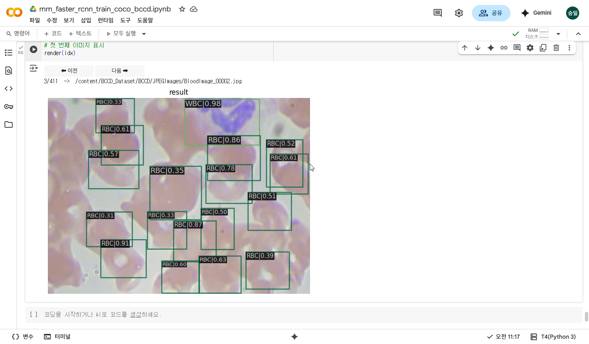

# BCCDViewer

Windows 환경에서 **MMDetection 프레임워크**를 활용하여  
혈액 세포 이미지(BCCD Dataset)를 학습·추론하고, **객체 탐지 결과를 시각화**하는 Python 기반 툴입니다.  
Google Colab 환경에서 학습된 모델을 Visual Studio Code 환경으로 가져와 CPU/GPU에서 추론할 수 있도록 구현되었습니다.

---

## 📦 프로젝트 개요

- **플랫폼:** Visual Studio Code (Python 3.11)  
- **프레임워크:** MMDetection  
- **목적:** 혈액 세포 이미지에서 WBC, RBC, Platelets 객체 탐지 및 시각화  
- **데이터셋:** BCCD Dataset (COCO 형식 변환)  
- **결과물:** PyTorch 학습 모델(.pth), 검출 결과 이미지/오버레이

---

## ✅ 주요 기능

### 1. 📂 모델 학습 & 추론
- Google Colab에서 Faster R-CNN + FPN 기반 모델 학습
- 학습된 `.pth` 체크포인트를 로컬(VS Code)로 가져와 재사용

### 2. 🖼️ 단일 이미지 추론
- `inference_detector`를 이용한 단일 이미지 예측
- 클래스별 색상 고정:
  - **WBC:** 밝은 초록
  - **RBC:** 빨강
  - **Platelets:** 파랑

### 3. 🔍 이미지 탐색 UI
- `matplotlib` + Prev/Next 버튼 UI로 폴더 내 모든 이미지 순차 검사
- 키보드(←, →, A, D) 단축키 지원

### 4. 💾 결과 저장
- MMDetection 기본 스타일 결과 이미지 저장
- 커스텀 반투명 오버레이 버전 별도 저장 가능

### 5. ⚙️ CPU/GPU 자동 전환
- CUDA 사용 가능 시 GPU(`cuda:0`) 자동 선택, 없으면 CPU 모드로 실행

### 6. 🧩 유연한 경로 지정
- Config 파일 경로, 체크포인트 파일 경로, 테스트 이미지 경로를 코드 상단에서 설정 가능
- 체크포인트 경로 미지정 시 `WORK_DIR` 내 최신 `.pth` 자동 탐색

---

## 🧰 사용 방법

1. BCCD Dataset을 COCO 형식(`train.json`, `val.json`, `test.json`)으로 변환
2. Google Colab에서 학습 수행 후 `.pth` 모델 파일 다운로드
3. 로컬 환경(VS Code) 프로젝트 디렉토리에 모델 파일 저장
4. `CONFIG_FILE`, `CHECKPOINT_FILE`, `IMG_PATH` 경로 수정
5. `run_bccd.py` 실행 → 추론 UI 표시
6. Prev/Next 버튼 또는 키보드로 이미지 탐색

---

## 🔧 개발 환경 및 라이브러리

| 구성 요소 | 내용 |
|------------|------|
| 언어 | Python 3.11 |
| 프레임워크 | MMDetection |
| UI 라이브러리 | Matplotlib |
| 이미지 처리 | OpenCV-Python |
| 병렬화 | MMCV, MMDataParallel |
| 실행 환경 | Visual Studio Code, Windows 10 |

---
